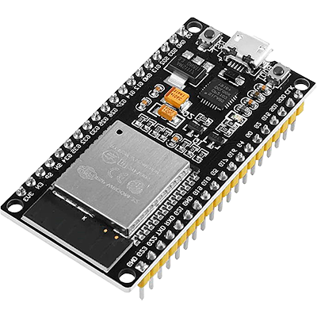

## ESP32 API REST + Smart Home App

<p align="center">
  
</p>

## ESP32 Routes:
**GET**
/api/lights/
```json
//Response
{
    "pin16": false,
    "pin17": false
}
```
<br/>

**POST** /api/lights/pin16=1
```json
//Response
{
    "pin16": true,
    "pin17": false
}
```